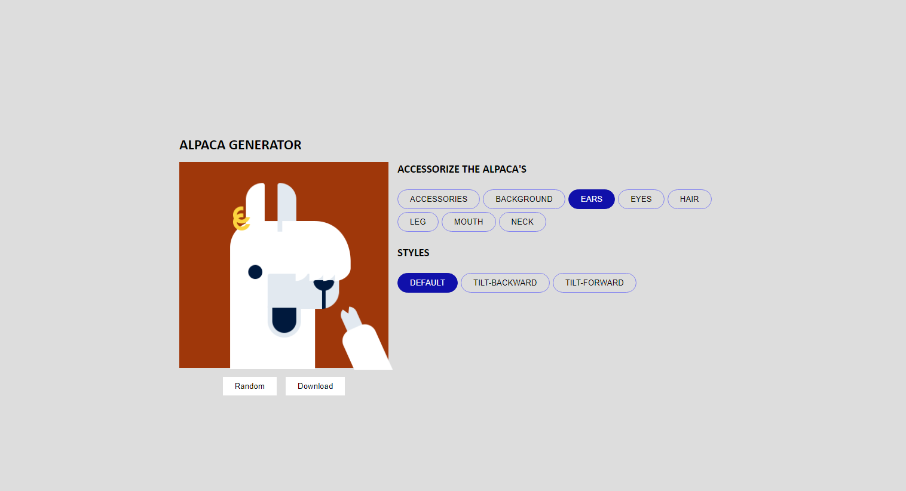

# DevProjects - Alpaca image generator website

This is an open source project from [DevProjects](http://www.codementor.io/projects).
Find the project requirements here: [Alpaca image generator website](https://www.codementor.io/projects/web/alpaca-image-generator-website-ce2oc0eus8)

## Tech/framework used
Built with vue 3.

## Screenshots and demo
Screenshots of your app and/or a link to your live demo

## Installation
* Clone the  repo.
* npm install all dependencies.
* npm start

## License
[MIT](https://choosealicense.com/licenses/mit/)
Most open source projects use the MIT license. Feel free to choose whichever license you prefer.